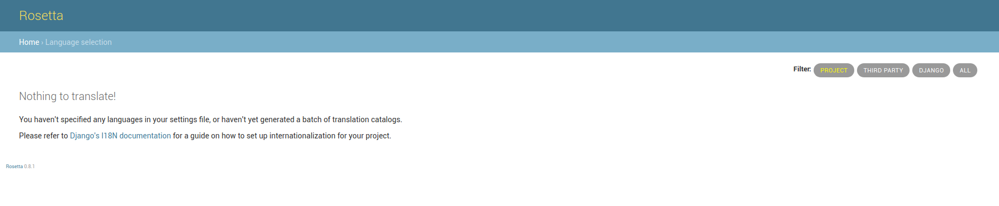
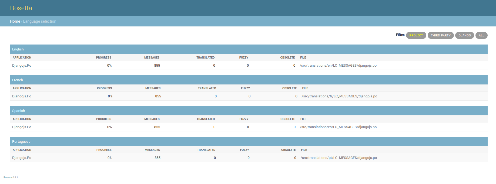
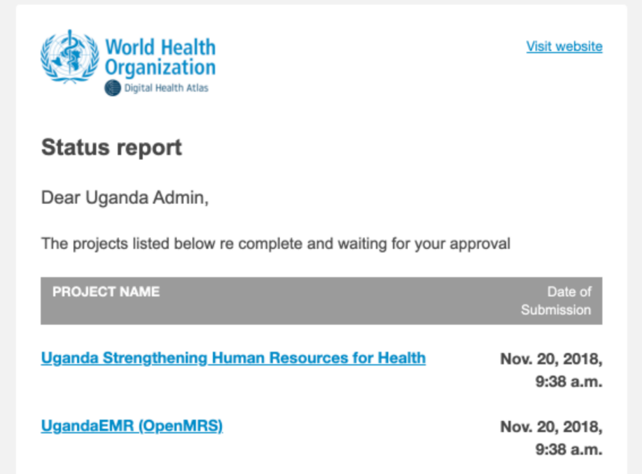
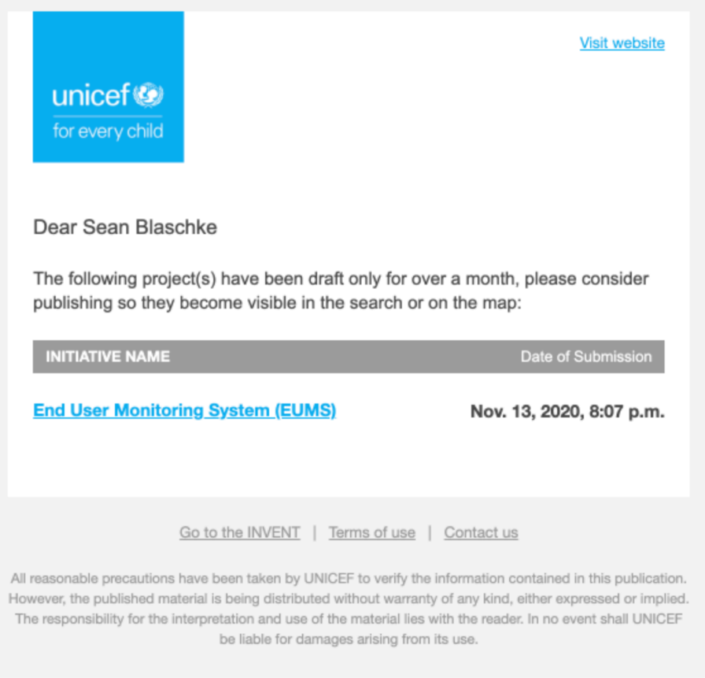
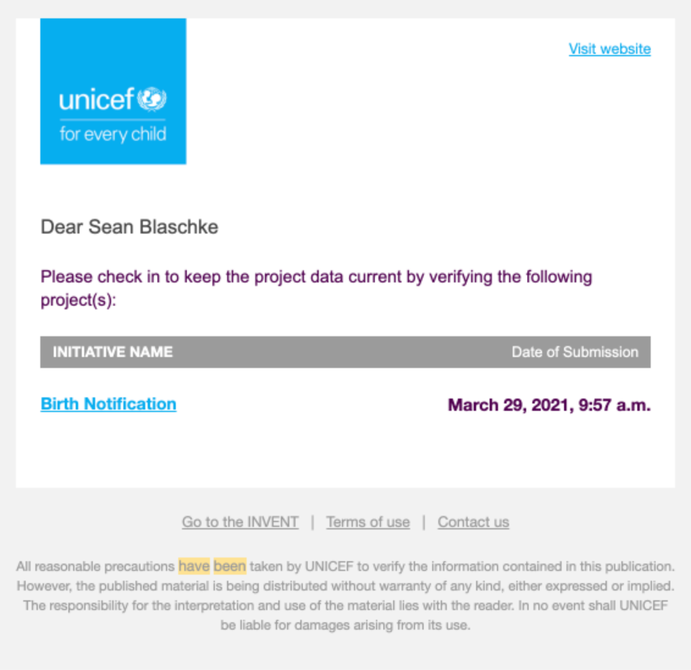
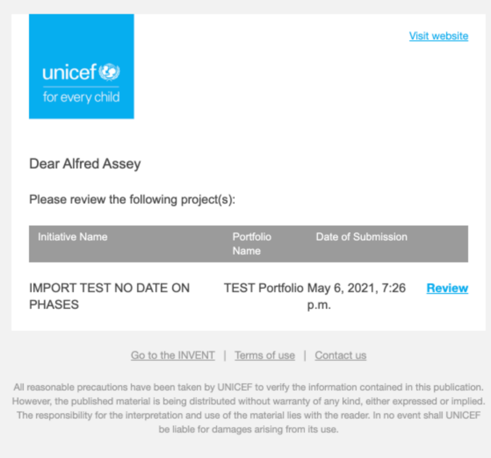
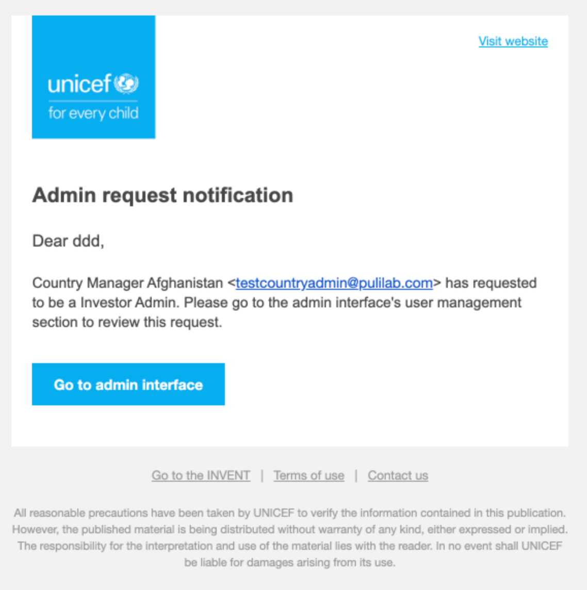
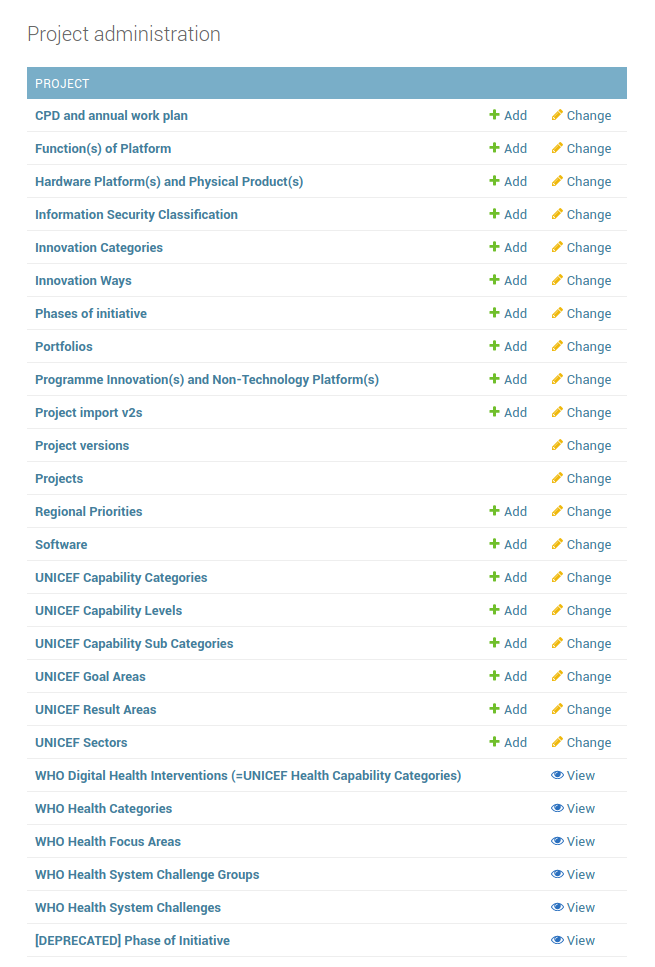

# Administration Manual

## Translations
The interface to run and configure translations is loaded in http://localhost/translate. Backend uses Rosetta Django application that eases the translation process in django projects and can be configured via parameters defined in ```django/tiip/settings.py``` file (see [rosetta-settings](https://django-rosetta.readthedocs.io/settings.html)
When logging for the first time the following page will appear when filtered by **PROJEC**T:

:::{figure-md} translations1



**STranslations - Rosetta Screen (no translations loaded)**
:::


The languages currently supported by the project and will be referenced as LANG below are the following: 
* en: English
* fr: French
* es: Spanish
* pt: Portuguese
* ar: Arabic

To manually update translations for frontend run the following command:
```bash
docker-compose exec django python manage.py update_translations master.pot
```

Message files (```djangojs.po```) will be generated under ```/translations/LANG/LC_MESSAGES``` which handles translations for full frontend as shown in the screenshot below:


:::{figure-md} translations2



**Translations - Rosetta Screen (frontend translations loaded)**
:::


In order to update translations for backend static data execute the following command to create message files(```django.po```) for each new language. For example, for Engish language:
```bash
docker-compose exec django django-admin makemessages -l en 
```

The makemessages script runs over the application source tree and pulls out all strings marked for translation. It creates (or updates) a message file in the directory ```locale/LANG/LC_MESSAGES```. In the example above, the file will be ```locale/en/LC_MESSAGES/django.po```.

Execute the same command for other supported languages:
```bash
docker-compose exec django django-admin makemessages -l fr
docker-compose exec django django-admin makemessages -l es
docker-compose exec django django-admin makemessages -l pt
docker-compose exec django django-admin makemessages -l ar
```

Then compile the message files created above by executing:
```bash
docker-compose exec django django-admin compilemessages
```

Finally, the Project Translation page will have the following items and the translations are ready to use.

:::{figure-md} translations3


**Translations - Rosetta Screen (backend translations loaded)**
:::

## User Management
This section contains instructions how a superuser can create / modify / delete users and super users.

### ser creation
A superuser has to login to http://localhost/admin
Under AUTHENTICATION AND AUTHORIZATION tab click on “Users” and the on the right corner clicks on “Add user”. Alternatively, click on “Add” icon next to “Users”. 
Fill in the requested fields username/password and in the “USER PROFILES” add UNICEF as Donor and add user’s organization.
Finalize by clicking “SAVE”. 
When the user tries to login it will fail because the organization has not been created.
In order to create the organization, execute the following and provide the UNICEF Organization to the invoked shell:
```bash
docker-compose exec django python manage.py shell


from user.models import Organisation
Organisation.objects.create(name=’UNICEF’)
```

Then restart django backend:
* Stop the running process by typing ```CTRL+C```
* Run the command ```docker-compose up``` to apply the above change

### User modification
Modify a user by clicking on the user’s related USER PROFILE checkbox. Apply the necessary changes and click on SAVE.

### User deletion
Delete a user by clicking on the user’s related USER PROFILE checkbox. Then select from the “Action’ drop-down menu “Delete selected users”. Alternatively, enter the user’s information as before and click on “DELETE” red button. A redirection page appears to confirm the deletion. 

## Emails
Emails are sent to notify users or superusers in order to take some actions on pending issues  or inform them about new requests. The email templates along with the corresponding task are the following:

* send_project_approval_digest 
:::{figure-md} send_project_approval_digest



**Email send_project_approval_digest**
:::

* project_still_in_draft_notification
:::{figure-md} project_still_in_draft_notification



**Email project_still_in_draft_notification**
:::

* published_projects_updated_long_ago
:::{figure-md} published_projects_updated_long_ago



**Email published_projects_updated_long_ago**
:::


* project_review_requested_monthly_notification
:::{figure-md} project_review_requested_monthly_notification



**Email project_review_requested_monthly_notification**
:::


* project_review_requested_on_create_notification
:::{figure-md} project_review_requested_on_create_notification


**Email project_review_requested_on_create_notification**
:::


* notify_superusers_about_new_pending_approval
:::{figure-md} notify_superusers_about_new_pending_approval


**Email notify_superusers_about_new_pending_approval**
:::


* notify_user_about_approval
:::{figure-md} notify_user_about_approval


**Email notify_user_about_approval**
:::


* send_user_request_to_admins
:::{figure-md} send_user_request_to_admins



**Email send_user_request_to_admins**
:::


## Scheduled Tasks
There are some scheduled tasks configured in the application regarding actions where notification mails should be sent. These tasks are defined under ```django/project/tasks.py```: 

```{list-table} Docker Images
:header-rows: 1
:name: docker-images-table

* - Task Name
  - Description
  - How it is triggered
* - project_review_requested_on_create_notification
  - New project review request
  - When portfolio admins make a new review initiation
* - project_review_requested_monthly_notification
  - Sent to users who have incomplete reviews	
  - scheduled to run every 30 days
* - project_still_in_draft_notification
  - One or more of user’s projects have not been published yet
  - scheduled to run every 31 days
* - published_projects_updated_long_ago
  - One or more of user’s projects have not been updated for 6 months
  - scheduled to run every 31 days
* - send_project_approval_digest
  - Action required: New projects awaiting approval
  - scheduled to run everyday
* - notify_superusers_about_new_pending_approval
  - Sent to superusers 
  - When new software/hardware/nontech/platform function is added in the "Other" request
* - notify_user_about_approval
  - Sent to user who requested such object
  - When admin declines a newly requested software/hardware/nontech/platform function by the user
```

and ```django/user/tasks.py```:
```{list-table} Docker Images
:header-rows: 1
:name: docker-images-table

* - Task Name
  - Description
  - How it is triggered
* - send_user_request_to_admins
  - Sent to user who requested a special role on signup
  - When user signs up for the first time and chooses a special role (chooser disabled currently on Invent)
```

## Load Taxonomies
Taxonomies are loaded automatically when executing the migration during the backend deployment phase 6.6.2 and can be viewed in administration page.

:::{figure-md} taxonomies-loaded



** Taxonomies Load Screen**
:::


When selecting to see for example the available options for UNICEF Sectors the following list appears

:::{figure-md} taxonomies-loaded2


** Taxonomies Load Screen**
:::

## Rebuilding search
Rebuild search should be executed when the data related to project application are modified from command line in order to reflect the changes in search engine. To execute rebuild search management command run the following:
```bash
docker-compose exec django python manage.py rebuild_search
```


## Enable logging
Django uses Python’s built-in logging module to perform system logging. In order to be configured, LOGGING is used to define a dictionary of logging setting. These settings describe the loggers, handlers, filters and formatters for logging setup and the log levels and other properties that the components should have and can be found under ```django/tiip/setting.py``` file. Fore more information, see the [official Django documentation)(https://docs.djangoproject.com/en/4.0/topics/logging/#topic-logging-parts-handlers).

## Enable debugging
Debug mode is recommended to be set to True while developing locally and false when deploying a site into production. Debug mode is set and can be modified in ```django/tiip/settings.py``` file. One of the main features of debug mode is the display of detailed error pages. As a security measure, Django will not include settings that might be sensitive, such as SECRET_KEY. For more information, see the [official Django documentation](https://docs.djangoproject.com/en/4.0/ref/settings/).

## Upgrade DB
Django uses Migrations as a way of propagating changes made on models into the database schema. For more information, see https://docs.djangoproject.com/en/4.0/topics/migrations/. The following commands should run on the local development environment in order to interact with migrations and Django’s handling of database schema.
```bash
docker-compose exec django python manage.py makemigrations
docker-compose exec django python manage.py migrate
```


