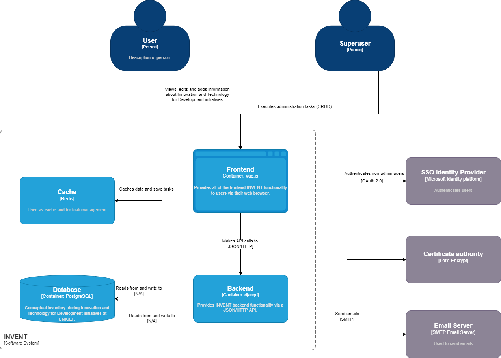
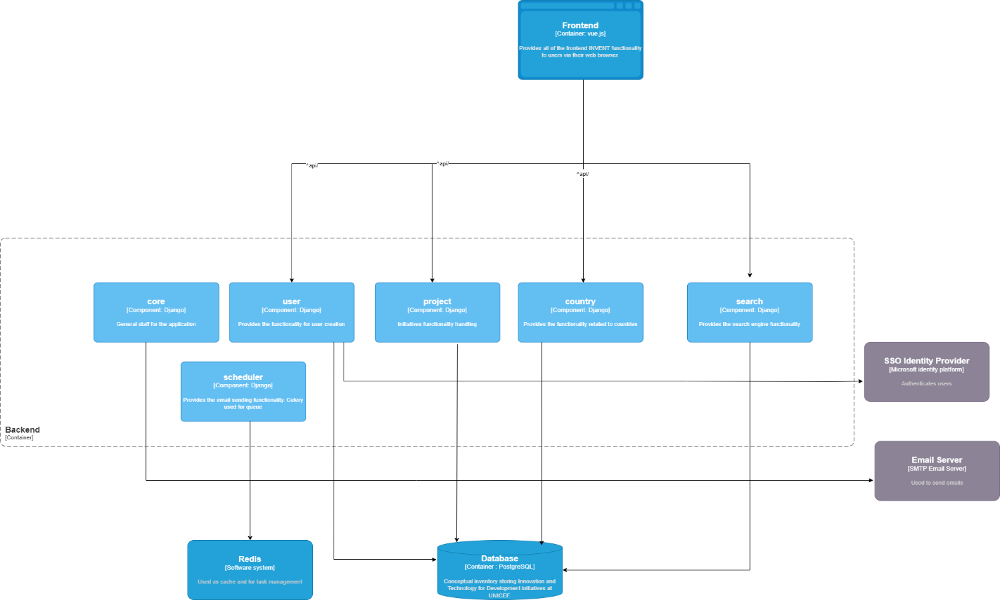
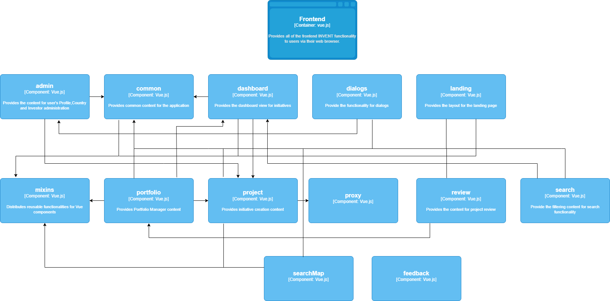

 # Core Diagrams
 The architecture overview diagram is defined according to C4 model by the following viewpoints :
* The Level 1: A System Context diagram provides a starting point, showing how the software system in scope fits into the world around it;
*The Level 2: A Container diagram zooms into the software system in scope, showing the high-level technical building blocks;
* The Level 3: A Component diagram zooms into an individual container, showing the components inside it;
* The Level 4: A code (e.g. UML class) diagram can be used to zoom into an individual component, showing how that component is implemented.

The Architecture Decisions (see {ref}`myst_cheatsheet`) are evident on the design and software solutions chosen.

## System Context diagram
The [System Context Diagram](system-context-diagram) shows the system context of the INVENT system. A system context diagram defines the boundary between the system or part of a system, and its environment, showing the actors and system entities that interact with it. The yellow parts show the actors and roles that interact with the system. The grey parts are external systems which the INVENT System shall interact with and are not described in the following sections.


:::{figure-md} system-context-diagram


**INVENT System Context Diagram**
:::

### External Interfaces


```{list-table} External Interfaces
:header-rows: 1
:name: invent-external-interfaces-table

* - Source
  - Target
  - Protocol / Standard
  - Description
* - User
  - INVENT
  - HTTP
  - A user can navigate to INVENT application using a browser to view and add information about Innovation and Technology for Development initiatives
* - Superuser	
  - INVENT
  - HTTP
  - A superuser can have additional access to INVENT administration system and execute administration tasks
* - SSO identify Provider
  - INVENT
  - OAuth 2.0
  - Used to authenticate users
* - Certificate Authority
  - INVENT
  - ACME
  - Let’s encrypt is used as Certification Authority that provides certificates for TLS encryption
* - Email Server
  - INVENT
  - SMTP
  - Used to send emails
```

## Container diagram for INVENT System
The following Container diagram zooms into the internals of the INVENT System, showing the high-level technical building blocks:


:::{figure-md} system-container-diagram



**INVENT System Container Diagram**
:::


### Internal Interfaces
```{list-table} Internal Interfaces
:header-rows: 1
:name: invent-internal-interfaces-table

* - Source
  - Target
  - Protocol / Standard
  - Description
* - User
  - INVENT
  - HTTP
  - A user can navigate to INVENT application using a browser to view and add information about Innovation and Technology for Development initiatives
* - Frontend
  - Backend/Django
  - JSON/HTTP API calls
  - Frontend uses django api to fetch and save all the information for INVENT application. The API can be accessed as pOAS](http://localhost/api/docs/) or [Redoc](http://localhost/api/devdocs/). Screenshots are provided as {ref}`annex_6`) and {ref}`annex_7`) respectively.
* - Backend/Django
  - Database/PostgreSQL
  - TCP Unix socket creation
  - Backend executes queries to read / from and write to DB
* - Backend/Django
  - Cache
  - TCP Unix socket creation
  - Cache storee scheduled tasks that send email notifications
```


### External Interfaces
```{list-table} External Interfaces
:header-rows: 1
:name: invent-external-interfaces-table

* - Source
  - Target
  - Protocol / Standard
  - Description
* - User
  - Frontend
  - HTTP
  - A user can login to INVENT application to add, edit or view the content about Innovation and Technology for Development initiatives
* - Superuser
  - Frontend
  - HTTP
  - Superuser executes administration tasks, apart from INVENT application as a user
* - Backend/Django
  - Email Server
  - SMTP
  - Backend communicates with the email server responsible for sending emails.
* - Frontend
  - SSO Identity Provider
  - OAuth 2.0
  - Used to authenticate users
```


## Component Diagrams
### Backend Component diagram

:::{figure-md} backend-component-diagram



**Backend Component Diagram**
:::

#### Django Applications

```{list-table} Django Applications
:header-rows: 1
:name: django-applications-table

* - Django Application
  - Description
* - core
  - Provides general staff for the application
* - country
  - Provides the countries related functionality 
* - project
  - Provides the basic INVENT functionality for Initiatives handling
* - scheduler
  - Provides the schedule of email sending
* - search
  - INVENT search engine
* - user
  - Provides the functionality for user profile creation and user actions
```

#### Internal Interfaces
```{list-table} Backend Internal Interfaces
:header-rows: 1
:name: backend-internal-interfaces-table

* - Source
  - Target
  - Protocol / Standard
  - Description
* - project
  - Database
  - TCP Unix socket / port 5432
  - Accesses PostgreSQL DB using the engine django.db.backends.postgresql_psycopg2. Queries to add/delete/modify projects in INVENT.
* - search
  - Database
  - TCP unix socket / port 5432
  - Accesses PostgreSQL DB using the engine django.db.backends.postgresql_psycopg2. Queries for search execution in INVENT.
* - user
  - Database
  - TCP unix socket / port 5432
  - Accesses PostgreSQL DB using the engine django.db.backends.postgresql_psycopg2. Queries to add/delete/modify user profiles in INVENT.
* - country
  - Database
  - TCP unix socket / port 5432
  - Accesses PostgreSQL DB.Queries to add/delete/modify countries in INVENT.
* - scheduler
  - Cache
  - TAccessed with Celery / port 6379
  - Redis used as message broker. Connection string configured with BROKER_URL in django/tiip/settings.py
```


#### External Interfaces
```{list-table} Backend External Interfaces
:header-rows: 1
:name: backend-external-interfaces-table

* - Source
  - Target
  - Protocol / Standard
  - Description
* - User
  - MS Id Platform
  - OAuth 2.0
  - Used for the user authentication
* - nginx
  - letsencrypt
  - ACME
  - Certification Authority to enable HTTPS. Certbot is a free, open source software tool for automatically using Let’s Encrypt certificates to enable HTTPS
* - core
  - Email Server
  - SMTP
  - Used to send emails. Configuration found in django/tiip/settings.py
```


### Frontned Component diagram

:::{figure-md} frontend-component-diagram



**Frontend Component Diagram**
:::

#### Modules
Vue.js modules are configured in frontend/package.json and can be modules required during development (devDependencies) or modules which are required at runtime (dependencies).

##### Development dependencies
To add a dependency as a devDependency execute the following:
```bash
npm install --save-dev
```

##### Runtime dependencies
To add a dependency as dependency execute the following:
```bash
npm install --save.
```

#### Scripts
The following scripts are supported (configured in frontend/package.json):
```{list-table} Frontend Scripts
:header-rows: 1
:name: frontend-modules-table

* - Command
  - Description
* - yarn build
  - Build and optimize the application with webpack for production
* - yarn start
  - Start the production server
* - yarn dev
  - The basic command sto start the frontend. Starts nuxt with paratemeters “NODE_OPTIONS='--max-old-space-size=4096' HOST=0.0.0.0 nuxt”
* - yarn dev:win
  - Launch the development server
* - yarn analyze
  - Nuxt use webpack-bundle-analyzer to let bundles visualization
* - yarn generate
  - Build the application (if needed), generate every route as a HTML file and statically export to dist/ directory (used for static hosting).
* - yarn lint
  - Runs ESLint, a tool for identifying and reporting on patterns found in ECMAScript/JavaScript code. It executes the command "eslint --fix --ext .js,.vue --ignore-path .gitignore ."
* - yarn precommit
  - Runs lint
* - yarn precommit:fix	
  - Runs lint with ‘–fix’ parameter
* - yarn test
  - Runs jest
* - yarn test:w
  - Runs jest --watch
* - yarn translation:extract
  - Runs a bash command “bash gettext.sh” to scrape the code and extract translation
```


### Database Component diagram
For the DB physical data model, see {ref}`supplementary_diagrams`).


