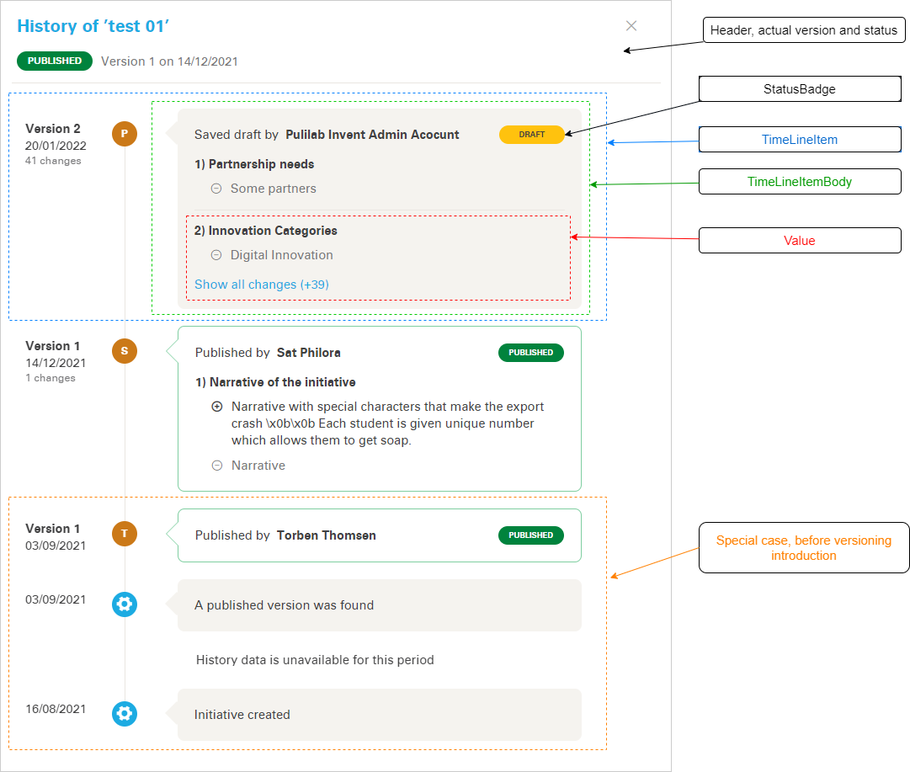

## Simple changelog

Version history of an initiative is displayed in a timeline view in a dialog (`ProjectHistoryDialog`).  
The Timeline component handles the proper UI flow.

:::{figure-md} changelog_anatomy



**Changelog anatomy**
:::


### Components

```
components
├─ project
│  └─ history
│     │  Timeline.vue            -> Wrap the whole history
│     │  TimelineItem.vue        -> Wrap one version
│     │  TimelineItemBody.vue    -> Contains the list of changes
│     │  TimelineItemNoData.vue  -> Snown when there is not data
│     └─ values
│        │  ValueCoverImage.vue  -> For cover image
│        │  ValuePartners.vue    -> For partners
│        │  ValuePhases.vue      -> For project phases
│        │  ValueSpecial.vue     -> For special values (indicated by backend)
│        │  ValueTags.vue        -> For values with with lists (tags)
│        │  ValueText.vue        -> For simple text (re values represented by text)
│        │  ValueWebsite.vue     -> For websites
│        │  SimpleMessage.vue    -> For when there is no addition info and want to show a simple message
└─ dialogs
   │  ProjectHistoryDialog.vue   -> The "simple" dialog
```

### Dialog

#### Parameters

The dialog can be displayed via the `open(projectParams)` method passing the project's key properties.

| Property | Type | Description |
| --- | --- | --- |
| id | number | Project id |
| created | date | Project creation date |
| title | string | Project title |
| teamMember | boolean | Indicates if the current user of the selected project is a team member or a viewer |

#### Data structure

The data structure can be seen in the example [mock data](_static/version_history.mock.json).

#### Data preparation

Backend provides the raw version history data in an array that needs to be converted on frontend.  
It also handles user's permission to the selected project.

As some of the fields are special, it was necessary to define a map for the fields (`fieldMap` variable) with the component, title and a parser function. Some of the fields has to be ignored, those are `undefined`.

```js
country: {
  component: 'ValueText',
  title: this.$gettext('Country'),
  parse: (countryId) => this.parseCountry(countryId),
}
```

The `getProjectHistory` method 
- run through the versions
  - clean up fields in changes (remove the `undefined` fields)
  - parse fields' changes (values)
- check the edge case if the project has been created before the versioning system has been introduced. If so, then add special items to the version list.
- set up current version of the project

UI is rendered based on the prepared data using [Vue Dynamic Components](https://v2.vuejs.org/v2/guide/components.html?redirect=true#Dynamic-Components) mechanism.