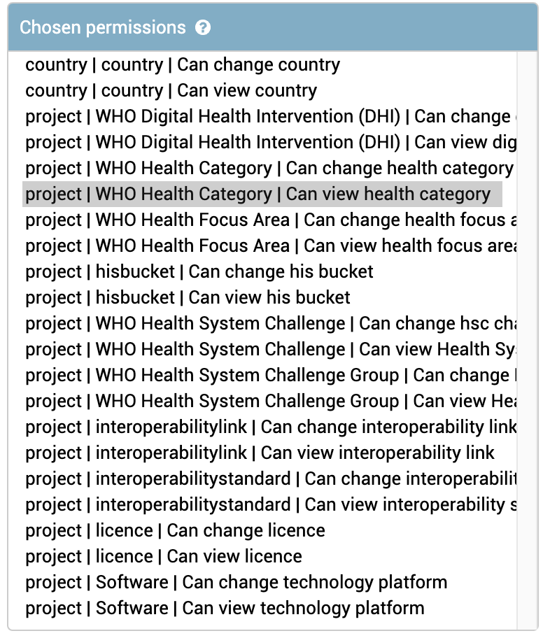

# Permission system

## Admin + User model layer

- `is_superuser` -- the highest permission in the system
- `is_staff` -- can login to django admin

### Group permissions for translators

Feel free to create group permissions if you have external translator clients. The group permission can be used to give access to the model translations.

:::{figure-md} translations1

**Group permission for Translators**
:::

## API layer

### `InTeamOrReadOnly` (object level permission)

Object must be a `Project` instance. It checks whether user is either of:
- team member (`project.team <m2m>`)
- superuser (`is_superuser <bool>`)
- country manager (Country/Unicef officee manager -- `userprofile.manager_of <m2m>`)

### `InCountryAdminForApproval` (object level permission)

Object must be a `ProjectApproval` instance. It checks whether user is either of:
- superuser (`is_superuser <bool>`)
- country admin (`country.admins <m2m>`)
- country super admin (`country.super_admins <m2m>`)

### `IsGPOOrReadOnly` (request level permission)

Checks if `request.user.userprofile.global_portfolio_owner` is True. If so, grants access to write methods, otherwise read only.

### `IsGPOOrManagerPortfolio` (object level permission)

Object must be a `Portfolio` instance. It checks whether user is either of:
- Global portfolio owner (`request.user.userprofile.global_portfolio_owner <bool>`)
- Portfolio manager (`portfolio.managers <m2m>`)

### `IsGPOOrManagerProjectPortfolioState` (object level permission)

Object must be a `ProjectPortfolioState` instance. It checks whether user is either of:
- Global portfolio owner (`request.user.userprofile.global_portfolio_owner <bool>`)
- Portfolio manager (`portfolio.managers <m2m>`)

### `IsReviewable` (object level permission)

Portfolio reviews can only be accessed by reviewers once
Object must be a `ReviewScore` instance and it checks if the user is a reviewer. If is then checks if the review status is complete. It only allows to write if the review status is not complete yet.

### `IsReviewerGPOOrManager` (object level permission)
Object must be a `ReviewScore` instance. It checks whether user is either of:
- Global portfolio owner (`request.user.userprofile.global_portfolio_owner <bool>`)
- Portfolio manager (`portfolio.managers <m2m>`)

Read only if:
- User is a reviewer

## Permission based data

There are several user roles that a userprofile can choose from (only one at a time):
- **Implementer** - the default user who has an account
- **Investor/Donor Viewer**
    - Can read/export responses to private investor questions
- **Investor/Donor Admin**
  - Can read/export responses to private investor-specific questions
  - Can create and delete investor-specific questions
  - Can select which questions are private and public
  - Can approve users to join the investor page
- **Investor/Donor System Admin**
  - Can read/export responses to private investor-specific questions
  - Can create and delete investor-specific questions
  - Can select which questions are private and public
  - Can approve users to join the investor page
  - Can customize and update investor home page
- **Country Viewer**
  - Can read/export responses to private Government questions
  - Can view when an initiative is approved/declined
- **Country Admin**
  - Can update Government map data
  - Can create and delete Government-specific questions
  - Can select which questions are private and public
  - Can read/export responses to private Government questions
  - Can approve users to join the Government page
  - Can approve initiatives if the initiative approval feature is active
- **Country System Admin**
  - Can update Government map data
  - Can create and delete Government-specific questions
  - Can select which questions are private and public
  - Can read/export responses to private Government questions
  - Can approve users to join the Government page
  - Can approve initiatives if the initiative approval feature is active
  - Can customize and update Government home page
- **Inventory User** - Deprecated role that was used for the previous import
