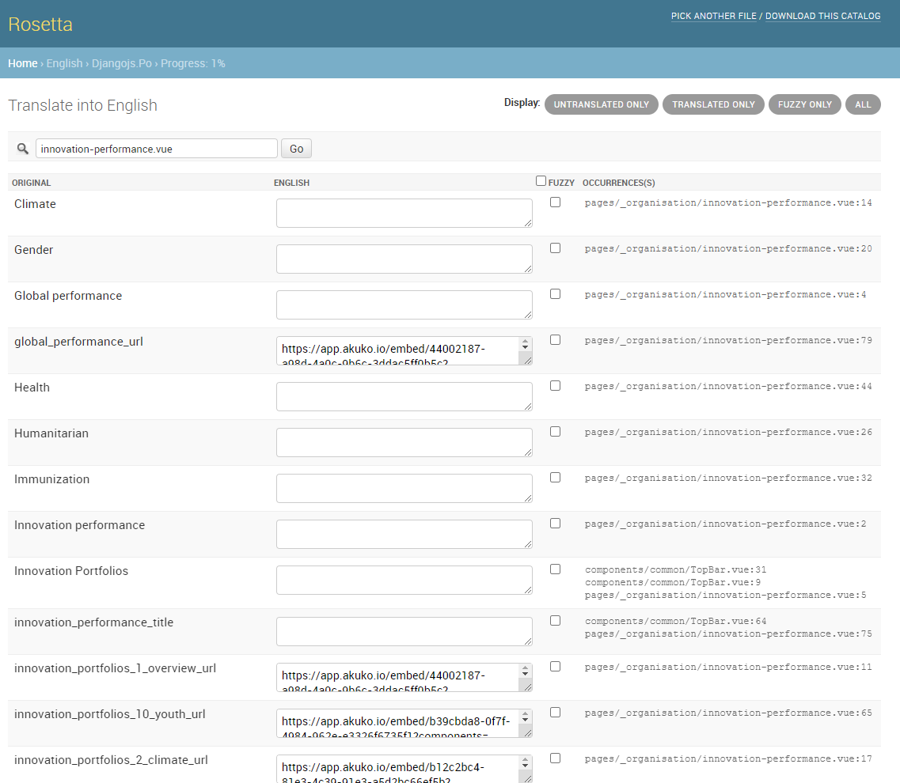

# Innovation performance

This special page's function is to embed the `Innovation Performance Portal` created and hosted on [Akuko - data publishing platform](https://akuko.io/).

The content is managed by changing the special URLs (`translatable tags`) that are embeded as iframes.

The easiest way to manage the tags on this page is by searching for the vue page component `innovation-performance.vue` in Rosetta.

:::{figure-md} innovation_performance_rosetta

**Manage URLs in Rosetta for Innovation performance page**
:::

:::{admonition} Note
:class: info

Take into account that after translating texts in Rosetta, the `django` docker container needs to be restarted via **`docker-compose restart django`** command.
:::