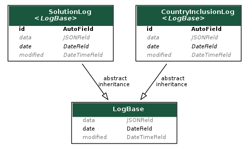

# KPI Engine
The KPI django application is responsible for calculating and storing relevant key performance indicators.
It's built to be extensible and reusable. It serves the calculated data through its APIs. 
In this section we will list the currently available KPI models and APIs.

:::{figure-md} kpi-model



**Model Diagram**
:::

## LogBase abstract model
This should be the base of any KPI models since it has the attributes to store data and timestamp.

## SolutionLog
SolutionLog is used to calculate performance indicators for solutions and portfolios.

### SolutionLog model & admin
To store data and the admin interface includes a JSON editor, so it can be changed on the fly.

A snapshot will look like this:
```python
[
  {
    "date": "YYYY-MM",
    "data": {
      "portfolios": [
        {
          "id": "<portfolio_id>",
          "investment_to_date": 999999,
          "innovation_hub": true,
          "status": "DR",
          "problem_statements": [
            "<problem_statement_id>"
          ],
          "solutions": [
            "<solution_id>"
          ]
        }
      ],
      "solutions": [
        {
          "id": "<solution_id>",
          "people_reached": 99999,
          "phase": "<choice_int>",
          "regions": [
            "<choice_int>"
          ],
          "countries": [
            {
                "id": "<country_id>",
                "region": "<choice_int>",
                "people_reached": 8888
             }
          ],
          "open_source_frontier_tech": true,
          "learning_investment": true,
          "problem_statements": [
            "<problem_statement_id>"
          ],
          "portfolios": [
            "<portfolio_id>"
          ]
        }
      ]
    }
  }
]
```

### SolutionLog API
`GET /api/kpi/solutions` to list every snapshot that has been created so far.

### SolutionLog periodic task
The current celery task is creating 1 snapshot per month. The periodic scheduler updates the current month's
snapshot every day, so for the current month you will get an updated snapshot every day.

Example celery beat schedule (settings.py) - it will run every day at 1AM
```python
CELERYBEAT_SCHEDULE["solution_log_task"]: {
    "task": "solution_log_task",
    "schedule": crontab(hour=1, minute=0),
}
```

## CountryInclusionLog
This KPI is calculating which countries have at least one project (initiative). The list of countries 
are controlled through some properties:

- `Country.is_included` - to include the country in the calculation
- `RegionalOffice.is_included` - to include the regional office in the calculation as +1 (serves as a country)
- `RegionalOffice.is_empty_option` - for signaling that the object is special, eg. N/A

The country inclusions are also collected by region.

### CountryInclusionLog model & admin
To store data and the admin interface includes a JSON editor, so it can be changed on the fly.

A snapshot will look like this:
```python
[
  {
    "date": "YYYY-MM",
    "data": {
      "regions": [
        {
          "id": "<region_id>",
          "countries":"<int>",
          "max_countries":"<int>"
        }
      ],
      "countries":"<int>",
      "max_countries":"<int>"
    }
  }
]
```

### CountryInclusionLog API
`GET /api/kpi/country-inclusion` to list every snapshot that has been created so far.

### CountryInclusionLog periodic task
The current celery task is creating 1 snapshot per month. The periodic scheduler updates the current month's
snapshot every day, so for the current month you will get an updated snapshot every day.

Example celery beat schedule (settings.py) - it will run every day at 1AM
```python
CELERYBEAT_SCHEDULE["country_inclusion_log_task"]: {
    "task": "country_inclusion_log_task",
    "schedule": crontab(hour=1, minute=0),
}
```
