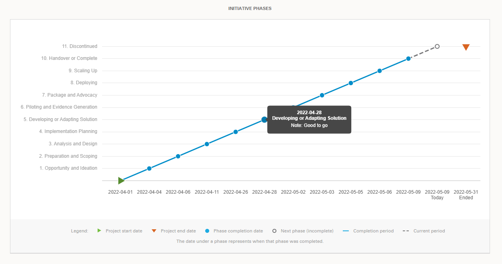

# Phases

Phases are defined in **project structure** on the backend. Can be retreived via `/api/projects/structure/` endpoint. It is the `stages` field in the result.

:::{admonition} Info
:class: info
Beware, `phases` sometimes called `stages` throughout the application.
:::

## Frontend

The completion of initiative phases are displayed on a `LineChart`. The proper data is prepared in `charts` store via `getStageData` action.  
The special thing about it is to differenciate which version of phase data to show (draft or published) and to calculate the **current phase**.  Checking the date `1970-01-01` is for old data, as in there was a time when the default date for the "empty" state was `1970-01-01`.

:::{figure-md} frontend_phases

**Almost complete initiative with all the phases**
:::