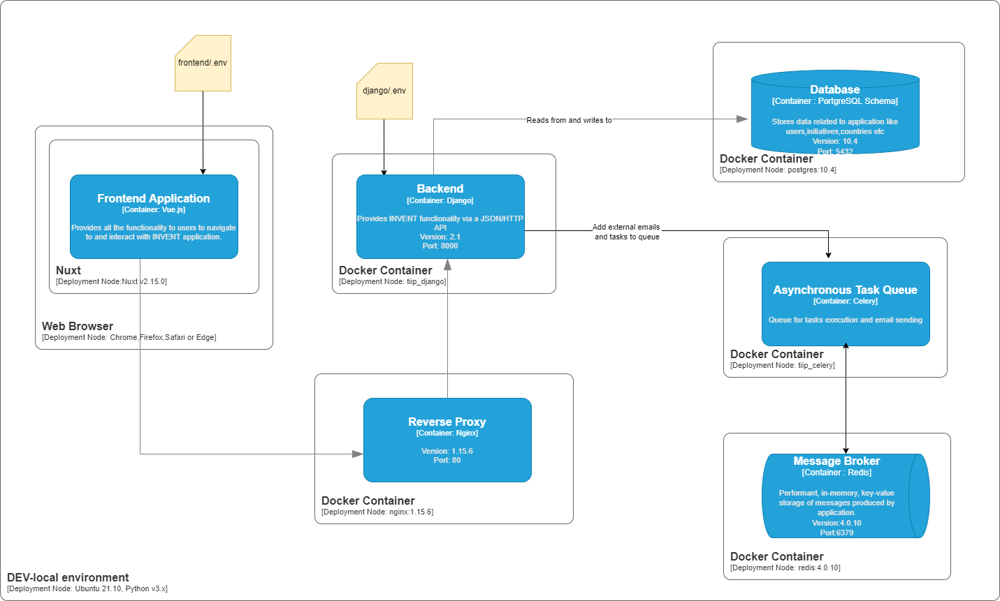
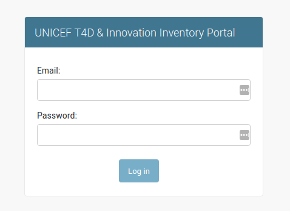
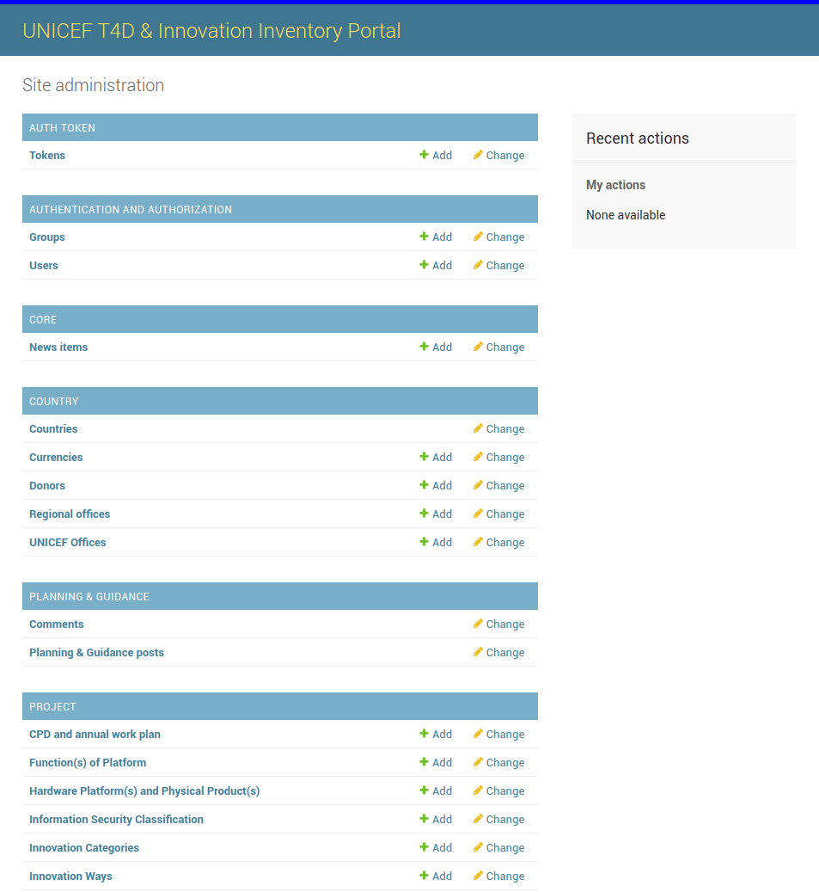
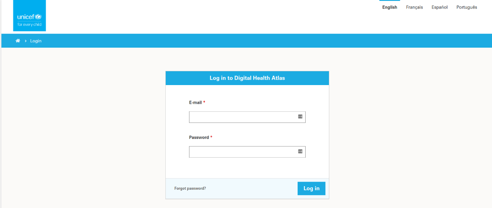
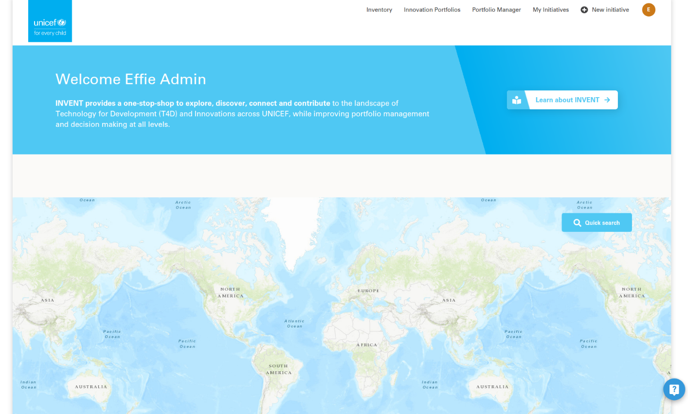
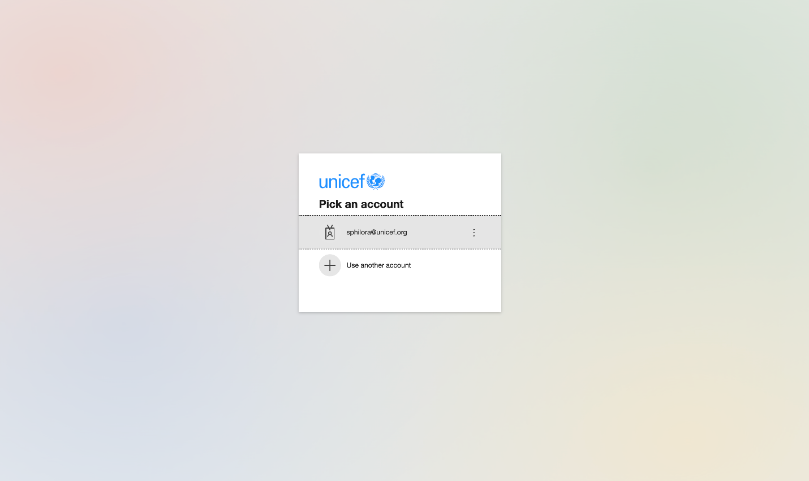

# Installation Manual

## Environment Prerequisites
Before the installation make sure that the DEV-local environment has properly installed and configure the following pre-requisites (instructions how to install are not provided):


```{list-table} Environment Prerequisites
:header-rows: 1
:name: environment-rerequisites-table

* - Prerequisite
  - Version
  - Description
* - OS
  - Linux (tested with Ubuntu 21.04), Mac and Windows supported
  - OS of the DEV-local environment
* - Python
  - 3.x (tested 3.7.11)
  - Python should be installed in the DEV-local environment; e.g. to execute manage.py
* - npm
  - 7.5.x (tested with 7.5.2)
  - Package manager for Javascript, used to install yarn
* - yarn
  - 1.22.x (tested with 1.22.17)
  - Package manager for code, recommended to install through npm package manager, which comes bundled with Node.js. Used to deploy the frontend application
* - docker
  - 20.x (tested with 20.17)
  - Software platform to create, manage and run applications. Backend applications are containerized.
* - docker-compose
  - 1.29.x (tested with 1.29.2)
  - Tool to define and run the multi-container Docker applications.
* - Web Browser
  - Chrome, Firefox, Safari or Edge latest versions
  - Used to access the SPA
```

:::{figure-md} deployment-diagram



**Deployment Diagram**
:::


## Clone repository
```bash
git clone <GIT_REPOSITORY_URL>
cd <GIT_REPOSITORY_NAME>
```

## Configure 
Copy``` <GIT_REPOSITORY_NAME>/django/.env.template``` to ```<GIT_REPOSITORY_NAME>/django/.env``` and provide the appropriate values (```required in django/tiip/settings.py```):
```bash
SECRET_KEY=<a random generated long alphabetic string eg dskgsjgssosdsfhaplfnfbkjnndbff>
DEBUG=False
PROJECT_NAME=
DEFAULT_FROM_EMAIL=
REDIS_URL=redis
AZURE_CLIENT_ID=
AZURE_SECRET=
AZURE_TENANT=
AZURE_CALLBACK_URL=
SENTRY_DSN=
EMAIL_SENDING_PRODUCTION=False
SIMPLE_FEEDBACK_SEND_TO=
API_MAINTAINER=
EMAIL_VALIDATOR_REGEX=
ENABLE_API_REGISTRATION=True
DEPLOY_VERSION=
```

Where:
```{list-table} Backend .env contents description
:header-rows: 1
:name: backend-env-table

* - Key
  - Optional/Mandatory
  - Description
* - ```SECRET_KEY```
  - Mandatory
  - A secret key for a particular Django installation. It provides cryptographic signing and it should be set to a unique, unpredictable value.
* - ```DEBUG```
  - Mandatory
  - A boolean that turns on/off debug mode
* - ```PROJECT_NAME```
  - Mandatory
  - Project name string, can include spaces
* - ```REDIS_URL```
  - Mandatory
  - Redis URL string
* - ```AZURE_CLIENT_ID```
  - Optional
  - The client(application) ID of an App Registration in the tenant. 
* - ```AZURE_SECRET```
  - Optional
  - A client secret that was generated for the App Registration. 
* - ```AZURE_TENANT```
  - Optional
  - The Azure Active Directory tenant(directory) ID. 
* - ```AZURE_CALLBACK_URL```
  - Optional
  - Azure login redirect URI
* - ```SENTRY_DSN```
  - Optional
  - DSN if you want to capture errors on Sentry [Sentry](https://sentry.io)
* - ```EMAIL_SENDING_PRODUCTION```
  - Optional
  - A boolean that turns on/off email sending through SMTP (False by default)
* - ```SIMPLE_FEEDBACK_SEND_TO```
  - Mandatory
  - Email address of administration who should get the Feedback module questions (Help(?) button on UI)
* - ```API_MAINTAINER```
  - Mandatory
  - Email address of the API maintainer visible on /api/docs
* - ```EMAIL_VALIDATOR_REGEX```
  - Optional
  - Regex that is used to limit email addresses that can be added as a team, viewer for an initiative
* - ```ENABLE_API_REGISTRATION```
  - Optional
  - Signups can be disabled through the API eg. in production to only use SSO not the internal API (True by default)
* - ```DEPLOY_VERSION```
  - Optional
  - Version number of the software deployed. Eg 1.0.0. Will be used on Django Admin header bar and on Seentry.
```

Copy``` <GIT_REPOSITORY_NAME>/frontend/.env.template``` to ```<GIT_REPOSITORY_NAME>/frontend/.env``` and provide the appropriate values:
```bash
HOST=localhost
PORT=3000
AZURE_CLIENT_ID=
AZURE_REDIRECT_URI=
AZURE_TENANT=
```

Where:
```{list-table} Frontend .env contents description
:header-rows: 1
:name: frontend-env-table

* - Key
  - Optional/Mandatory
  - Description
* - ```HOST```
  - Mandatory
  - The host url for frontend.
* - ```PORT```
  - Mandatory
  - The port that frontend is loaded. 
* - ```AZURE_CLIENT_ID```
  - Optional
  - The client(application) ID of an App Registration in the tenant.
* - ```AZURE_REDIRECT_URI```
  - Optional
  - The redirect_uri of the application, where authentication responses can be sent and received.
* - ```AZURE_TENANT```
  - Optional
  - The Azure Active Directory tenant(directory) ID. 
```


Configure database connection in ```django/tiip/settings.py```:
here:
```{list-table} Backend .env contents description
:header-rows: 1
:name: backend-contents-description-table

* - Location
  - Description
  - Example
* - ```DATABASES.default.ΝΑΜΕ```
  - Schema name
  - postgres
* - ```DATABASES.default.USER```
  - Username 
  - postgres
* - ```DATABASES.default.HOST```
  - Hostname
  - localhost
* - ```DATABASES.default.PORT```
  - Port
  - 5432
```

:::{admonition} Warning
:class: warning

This configuration assumes that PostgreSQL trusts connections from localhost else a password is required.
:::

Configure emails:
```{list-table} Backend .env contents description
:header-rows: 1
:name: backend-emails-table

* - Location
  - Description
  - Example
* - ```DEFAULT_FROM_EMAIL```
  - Used in ```send_mail methods``` to define the sender (FROM
  - UNICEF T4D & Innovation Inventory Portal <noreply@invent.unicef.org>
```

## Build
Change directory to the project’s root folder.
```bash
cd <GIT_REPOSITORY_NAME>
```

Build containers:
```bash
docker-compose build
```

This command will use the default ```docker-compose.yml``` file


::::{important}
Code changes are applied immediately in backend without the need to restart django.
::::

## Deploy backend
### Start containers
Change directory to the project’s root folder.
```bash
cd <GIT_REPOSITORY_NAME>
```

Start containers:
```bash
docker-compose up
```

This will load configuration from the file ```docker-compose.yml``` and load the following containers:


```{list-table} Docker Images
:header-rows: 1
:name: docker-images-table

* - Image
  - Description
* - nginx:1.15.6
  - Downloads docker image of nginx from Docker Hub and creates tiip_nginx container
* - postgres:10.4
  - Downloads docker image of postgres from Docker Hub and creates tiip_postgres container. Set environment for postgresql environment: {POSTGRESQL_DB=postgres, POSTGRESQL_USER=postgres, POSTRESQL_PASSWORD= postgres}
* - redis:4.0.10
  - Downloads docker image of Redis from Docker Hub and creates tiip_redis container
* - django
  - Creates tiip_django container and starts the django application with the command ```/usr/local/bin/gunicorn tiip.wsgi:application -w 2 -b :8000 --reload --timeout 120```
* - redis
  - Creates tiip_celery container and starts celery with the command ```/usr/local/bin/celery -A scheduler worker -B -l info```
```


### Create DB
Change directory to the project’s root folder.
```bash
cd <GIT_REPOSITORY_NAME>
```

Execute the following command to create the DB schema:
```bash
docker-compose exec django python manage.py migrate --noinput
```

### Deploy frontend
Change directory to the project’s root folder.
```bash
cd <GIT_REPOSITORY_NAME>/frontend
```

Execute the following to add the dependencies from frontend/package.json file and create node_modules folder:
```bash
yarn install
```
Execute the following to start the frontend server:
```bash
yarn dev
```


### Create superuser (at least one is required)
Change directory to the project’s root folder.
```bash
cd <GIT_REPOSITORY_NAME>
```

Execute the following to create a superuser:
```bash
docker-compose exec django python manage.py createsuperuser
```

Provide the required information, username, email and password.

A superuser can create more superusers as described in [](administration_manual.md).

### Validate successful installation


#### Login as superuser
Visit with the browser the URL http://localhost/admin and login:


:::{figure-md} superuser-login



**Superuser Login Screen**
:::

After a successful login the admin page is loaded:


:::{figure-md} superuser-homepage



**Superuser Homepage Screen**
:::


#### Login as user (local authentication)
Navigate to http://localhost:3000/en/-/login and enter the user’s credentials to login:

:::{figure-md} user-login



**User Login Screen**
:::

After a successful login the user is redirected to INVENTORY dashboard by clicking on “unicef” icon on the top left corner the home page is loaded.


:::{figure-md} user-homepage



**UserHomepage Screen**
:::


### Login as user (Azure Single Sign-On)


:::{figure-md} user-azure-login



**Superuser Login Screen**
:::


:::{figure-md} user-azure-login2


**Superuser Login Screen 2**
:::


